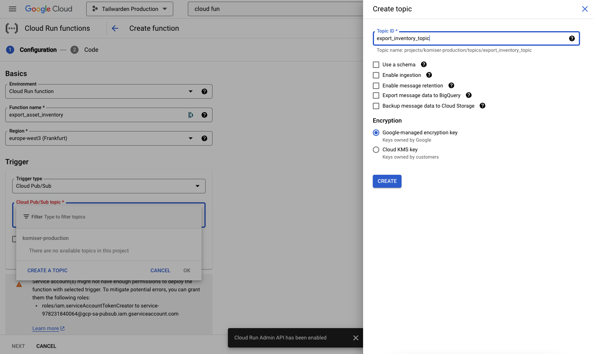
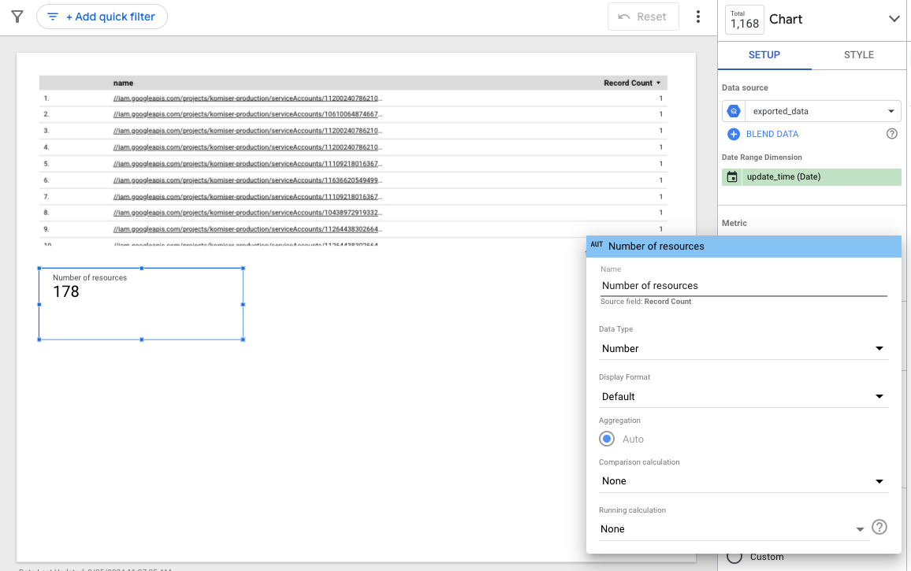

Similar to AWS, Google Cloud Platform offers its own set of services for asset inventory management. Let's explore some of the key GCP services for building and maintaining your cloud asset inventory.

[Cloud Asset Inventory](https://cloud.google.com/asset-inventory/docs/asset-inventory-overview) is a fully managed service that offers real-time visibility into the assets deployed across Google Cloud services. It enables organizations to track, manage, and query their resources, providing a detailed view of all active and historical assets. For FinOps teams, it ensures complete transparency and control over cloud expenses by offering an accurate and comprehensive snapshot of the resources being used across various projects and services. The service also supports detailed querying, allowing users to filter assets based on criteria such as resource type, project, or geographical location.

The integration of GCP Cloud Asset Inventory with other Google Cloud services further enhances its value. You can export asset data to BigQuery or Cloud Storage for detailed reporting and analysis or use Pub/Sub to trigger alerts based on specific changes in your cloud environment. For organizations focused on governance and compliance, Cloud Asset Inventory also integrates with GCP's IAM and policy services, making it easier to monitor the compliance of assets with security or cost-management policies.

To use Cloud Asset Inventory, you first need to enable the Cloud Asset API in your GCP project.  Once the service API is enabled, head to the Asset Inventory service. On this page, all resources will be listed and grouped by their resource type, project, and location, as shown in the following screenshot:


###### Figure 3.14. GCP Cloud Asset Inventory

If you want a list of individual resources, you can click on the “Resource” tab, where all resources will be listed by default. However, you can use the filters or search bar to filter out certain resources. 


###### Figure 3.15. List of active GCP resources

You can also export the resources as CSV files. This data can be analyzed using different tools, enabling you to uncover insights and perform in-depth analysis. The exported CSV file will have the following columns by default:


* Name
* Resource Type
* Project Id
* Display Name
* Create time
* Update time
* Status
* Folders
* Organization
* Parent asset type
* Parent full resource name
* KMS keys
* Direct tags
* Description
* Location
* Labels
* Network tags
* Additional attributes

You can use also use the GCP CLI to interact with Google Cloud Inventory. To use Cloud Asset Inventory, you first need to enable the Cloud Asset API in your GCP project. Then, you can issue the following command with the project ID as a scope, but you can also pass the folder or the organization ID as a scope:


#### Listing 3.14 Listing assets with the CLI


```
gcloud asset list --project=your-project-id
```


This command will return a list of all resources in the specified project. Below is an example of the output of the above command:


#### Listing 3.15  Output of the asset list command


```
ancestors:
- projects/978231840064
assetType: bigquery.googleapis.com/Table
name: //bigquery.googleapis.com/projects/PROJECT/datasets/DATASET_NAME/tables/datapoints
updateTime: '2024-09-25T07:31:24.244953Z'
---
ancestors:
- projects/978231840064
assetType: storage.googleapis.com/Bucket
name: //storage.googleapis.com/aws-billing-reports
updateTime: '2024-05-22T20:41:06.304678Z'
```


To get a more focused view, you can filter by resource type; for example, to list only GCP Storage Buckets, you can set the asset-types option to [storage.googleapis.com/Bucket](http://storage.googleapis.com/Bucket) as below:


#### Listing 3.16  List all storage buckets


```
gcloud asset list --project=your-project-id --asset-types=storage.googleapis.com/Bucket
```


In addition, exporting data to a CSV Cloud Asset Inventory allows you to export it to a Cloud Storage bucket or BigQuery dataset.

To export to a GCS, you need to create a storage bucket or choose an existing one:


###### Figure 3.16. Creating a storage bucket

Next, export the assets to the selected bucket by running the following command in your terminal:


#### Listing 3.17  Export assets to storage bucket


```
gcloud asset export --project PROJECT_ID --output-path=gs://asset-export-demo/2024-10-25.json
```


The following is an example of the command’s output:


#### Listing 3.18  Output of the command


```
Export in progress for root asset [projects/komiser-production].
Use [gcloud asset operations describe projects/978231840064/operations/ExportAssets/CONTENT_TYPE_UNSPECIFIED/f0bab74dc46af05587cc353754a68d5c] to check the status of the operation.
```


The export might take some time to complete, so you check the query operation using the ID returned in the command output. After a few seconds, a new JSON file will be created in the provided bucket:





###### Figure 3.17. Assets exported as a JSON file

You can now use that data to have your asset inventory. However, to keep your asset inventory up-to-date, it’s best to automate the export process. You can set up a Cloud Scheduler job to export the inventory data on a regular basis, such as daily or weekly, depending on your needs.

Another option is to export to a BigQuery dataset. Navigate to the BigQuery dashboard and click on “Create Dataset” to create a dataset where the export will be saved:


###### Figure 3.18. BigQuery dataset for storing assets

Now, run the following command to export the assets to the BigQuery dataset:


#### Listing 3.19  Command to export assets to BigQuery


```
gcloud asset export \
    --project=PROJECT_ID \
    --billing-project=BILLING_PROJECT \
    --content-type=resource \
--bigquery-table=projects/PROJECT_ID/datasets/cloud_resources/tables/exported_data \
    --output-bigquery-force
```


The command takes the following options: 


* **project_id**: The ID of the project whose metadata you want to export.
* **billing_project**: The project ID that the default Cloud Asset Inventory service agent is in has permission to manage your BigQuery datasets and tables. It's not required if you've already switched to the billing project with the gcloud config set project. [Read more about billing projects](https://cloud.google.com/asset-inventory/docs/faq#fail-write-to-storage).
* **content_type**: The asset [content type](https://cloud.google.com/asset-inventory/docs/overview#content_types). The access-policy content type can only be exported for an organization. If you export it for a project or folder, an empty table is created.
* **bigquery-table**: The table to which you're exporting your metadata. If it doesn't exist, it's created.

The command output will display the operation ID, which you can use to track the progress of the export, as it might take time to complete depending on how complex your GCP infrastructure is:


#### Listing 3.20  Output of the export command


```
Export in progress for root asset [projects/komiser-production].
Use [gcloud asset operations describe projects/978231840064/operations/ExportAssets/RESOURCE/230e55cdc518f3715d4795dc4bd438c6] to check the status of the operation.
```


Once the export is completed, head back to the BigQuery console. A new table called *exported_data* should be created with the list of assets exported, as shown in this screenshot:


###### Figure 3.19. Table content

Now that your asset data is in BigQuery, you can run queries to gain insights into your cloud resources and begin identifying opportunities for cost optimization. For instance, you can query for resources that have been running idle or haven’t been utilized effectively. For example, the following query will list terminated virtual machines:


#### Listing 3.21  SQL  Query to list terminated machines


```
SELECT
 JSON_EXTRACT_SCALAR(resource.data, '$.name') AS instance_name,
 JSON_EXTRACT_SCALAR(resource.data, '$.machineType') AS machine_type,
 JSON_EXTRACT_SCALAR(resource.data, '$.status') AS status,
 JSON_EXTRACT_SCALAR(resource.data, '$.creationTimestamp') AS creation_timestamp
FROM
 `PROJECT_ID.DATASET.exported_data`
WHERE
 JSON_EXTRACT_SCALAR(resource.data, '$.status') = 'TERMINATED'
```


Once your asset data is exported to BigQuery, the next step in creating visibility and actionable insights is to build a dashboard in Looker. Looker is a powerful business intelligence platform that integrates directly with BigQuery, allowing you to visualize your cloud asset inventory and identify areas for optimization. For FinOps teams, Looker dashboards provide a clear, real-time view of resource usage and costs, making it easier to enforce financial accountability.

Before creating the dashboard, you need to connect Looker to your BigQuery dataset. In Looker, navigate to the Admin section and set up a connection to your BigQuery project by selecting the BigQuery from the “Add data to report” modal:


###### Figure 3.20. Connecting BigQuery to Looker

Next, use the credentials from your Google Cloud project to configure the connection. Ensure that the correct permissions are granted so that Looker can access your BigQuery dataset:


###### Figure 3.21. Selecting the dataset and table where assets are stored

Click on the “Add” button, and once connected, select the *export_data* table that contains the asset inventory data. This will serve as the data source for your dashboard. Once done, the following report should be displayed:


###### Figure 3.22. List of resources widget

Next, to add visual elements, you can start by creating a **Scorecard** widget to track the number of cloud resources. From the “Add a chart” dropdown, select Scorecard. 


###### Figure 3.23. Adding a scorecard to Looker

Then update the title of the chart to “Number of resources” from the Metric section:


###### Figure 3.24. Tracking number of GCP resources

You can add other widgets, for instance, a pie chart that will track the number of resources by region:


###### Figure 3.25. Breakdown of asset by region

To make the dashboard dynamic, you add a filter at the top to be able to filter the stats based on service type. This can be done by selecting “Dropdown list” from the “Add a control” dropdown menu: 


###### Figure 3.26. Adding a global filter

Select “Service” as the control field, which will allow users to filter the displayed resources by specific services (e.g., BigQuery Table):


###### Figure 3.27. Filtering widgets output by service type

Now, if you choose a service, let's say BigQuery Table, the widgets will filter out the other services data points and show only results related to BigQuery Table resources, as shown in the example below:


###### Figure 3.28. Basic asset inventory dashboard

To automate data export and refresh the dashboard, we can use Google Cloud Function to handle regular exports of the asset data to BigQuery. The Function can be triggered via a Cloud Scheduler, which will send a message to a Pub/Sub topic and invoke the Function as a result, which will use the Cloud Asset Inventory API to export the data to a BigQuery dataset as shown in the following diagram:


###### Figure 3.29. Automating asset inventory export in GCP

First, create a folder where the Golang source code will be stored and run the following command in your project folder terminal:


```
go mod init
```


Then, add to the *main.go* file the following code snippet:


#### Listing 3.22 Go program to export assets to BigQuery


```
package export

import (
   "context"
   "fmt"
   "log"
   "time"

   "google.golang.org/api/cloudasset/v1"
)

// The dataset ID in BigQuery where the assets will be exported.
const (
   projectID = "your-project-id" // Replace with your GCP project ID
   datasetID = "your-dataset-id" // Replace with your BigQuery dataset ID
)

// CloudAssetExport is triggered by a Pub/Sub message.
func CloudAssetExport(ctx context.Context, _ interface{}) error {
   // 1. Create a timestamped table name with format: exported_data_YYYYMMDD_HHMMSS
   tableName := fmt.Sprintf("exported_data_%s", time.Now().Format("20060102_150405"))

   // 2. Set up the Cloud Asset API client
   assetService, err := cloudasset.NewService(ctx)
   if err != nil {
       log.Fatalf("Failed to create cloudasset service: %v", err)
       return err
   }

   // 3. Configure the export request to BigQuery
   exportRequest := &cloudasset.ExportAssetsRequest{
       // Set the output config to use BigQuery
       OutputConfig: &cloudasset.OutputConfig{
           BigqueryDestination: &cloudasset.BigQueryDestination{
               Dataset: fmt.Sprintf("projects/%s/datasets/%s", projectID, datasetID),
               Table:   tableName,
               Force:   true, // Overwrite table if it exists
           },
       },
   }

   // 4. Set up the export operation
   exportAssetsCall := assetService.V1.ExportAssets(fmt.Sprintf("projects/%s", projectID), exportRequest)

   // 5. Execute the export
   _, err = exportAssetsCall.Do()
   if err != nil {
       log.Fatalf("Failed to export assets: %v", err)
       return err
   }

   log.Printf("Cloud assets exported to BigQuery table: %s.%s", datasetID, tableName)
   return nil
}
```


The code above creates a Cloud Asset API client using the GCP Go SDK and sends a request to export the cloud assets to BigQuery with a dynamically generated table name based on the current timestamp.

Before deploying the code to GCP Cloud Run, we need to download the needed external Go packages and create a ZIP file by running the following commands: 


#### Listing 3.23  Commands to Create Deployment Package


```
go get -v
zip -r deployment.zip .
```


Next, we need to deploy the function to Cloud Run. Head back to GCP Console and navigate to Cloud Run Function service; from there, click on the “Create Function” button; the following modal should popup in case the API of the service hasn’t been enabled yet:


###### Figure 3.30. Cloud Run required APIs

Once the required APIs are enabled, you can create the function by giving it a name, selecting the region, and setting Cloud Pub/Sub as a trigger type. You would be asked to choose an existing topic or create a new one, as shown in the below screenshot:


###### Figure 3.31. Triggering a cloud run function with a pub/sub topic


    **Note **You can also enable the required APIs with the following command: gcloud services enable run.googleapis.com pubsub.googleapis.com cloudbuild.googleapis.com.

Leave everything by default and click on “Next.” you’ll be taken into the code editor, where you can choose ZIP upload and set Go 1.22 as the runtime and the entry point to *CloudAssetExport*:


###### Figure 3.32. Cloud function entrypoint configuration

Then, click on the “Deploy” button to deploy the cloud run function as shown below: 


###### Figure 3.33. Cloud run function details page

Next, click on the “Permissions” tab and provide the required permissions so the function can interact with the cloud inventory service and write the assets to the BigQuery dataset; this can be done by adding the following roles to the Cloud Function service account:


* **roles/cloudasset.viewer** (Cloud Asset Inventory viewer)
* **roles/bigquery.dataEditor** (BigQuery write access)
* **roles/cloudfunctions.invoker** (To allow the Pub/Sub to trigger the function)

By default, when you deploy a Cloud Function, it runs under the default service account of your project. This service account follows this pattern:


```
[PROJECT_NUMBER]@cloudservices.gserviceaccount.com
```


You can get the *PROJECT_NUMBER* using:


#### Listing 3.24 List project number ID


```
gcloud projects describe [YOUR_PROJECT_ID] --format="value(projectNumber)"
```


For example, if your project number is *1234567890*, the service account would be:


```
1234567890@cloudservices.gserviceaccount.com
```


Alternatively, if you're using a custom service account for your Cloud Function, you can find the service account used during the Cloud Function creation.

Use the following *gcloud* commands to grant the necessary roles to the service account:

This role is required to allow the Cloud Function to view the cloud assets.


#### Listing 3.25 Assign Cloud Assets Viewer role


```
gcloud projects add-iam-policy-binding [YOUR_PROJECT_ID] \
    --member "serviceAccount:[PROJECT_NUMBER]@cloudservices.gserviceaccount.com" \
    --role "roles/cloudasset.viewer"
```


This role is required to allow the Cloud Function to write data to BigQuery tables.


#### Listing 3.26  Assign BigQuery Data Editor role


```
gcloud projects add-iam-policy-binding [YOUR_PROJECT_ID] \
    --member "serviceAccount:[PROJECT_NUMBER]@cloudservices.gserviceaccount.com" \
    --role "roles/bigquery.dataEditor"
```


And to ensure the Pub/Sub topic is triggering the function, add the following rule to the service account:


#### Listing 3.27  Assign CloudFunctions Invoker role


```
gcloud projects add-iam-policy-binding [YOUR_PROJECT_ID] \
    --member "serviceAccount:[PROJECT_NUMBER]@cloudservices.gserviceaccount.com" \
    --role "roles/cloudfunctions.invoker"
```


Next, create a cron job with Cloud Scheduler by creating a new schedule with the below values. In the example below, we’re pushing an empty message body to the Pub/Sub topic every 6 hours:


###### Figure 3.34. Cron job configuration

Once created, you can test it out by clicking on the “Force run” button:


###### Figure 3.35. Triggering cron job manually

Then, go back to the cloud run function and click on the “Logs” tab to check if the function was successfully invoked. As shown below, the function was triggered, and a new snapshot of the inventory was pushed to the BigQuery dataset:


###### Figure 3.36. Cloud run function execution logs

You can verify if a new table was created by jumping to the BigQuery dataset and listing the created tables: 


###### Figure 3.37. BigQuery table created successfully

Congrats! You’ve successfully deployed a Golang function to Cloud Run that will create a snapshot of your cloud asset inventory to BigQuery and set it up to be triggered by Pub/Sub. 

The asset inventory in BigQuery now serves as a central database for all cloud resources across your projects. With regular exports of asset metadata and continuous data analysis, you can:


* **Track resource usage trends**: Understand how different teams and projects are utilizing cloud resources over time.
* **Identify unused or underutilized assets**: Detect resources that are not contributing to business goals but are still incurring costs.
* **Optimize cloud spend**: Use insights from the asset inventory to optimize cloud resource usage, leading to better cost management and more efficient operations in line with FinOps principles.

Now that we've explored how to build an asset inventory on GCP, it’s time to look at Azure's approach.


# 3.4 Managing Your Azure Inventory

Microsoft Azure, like AWS and GCP, provides its own set of tools for asset inventory and management. Let's explore some of the key Azure services that can help you build and maintain your cloud asset inventory.

Azure Resource Graph is a key service that helps you find and manage your Azure resources quickly and at a large scale. It allows you to run queries to explore your resources across all your Azure subscriptions, making it easier to build a complete inventory. You can use it to find resources that are not being fully used, track usage patterns, and get a better view of how different teams or projects are spending on cloud resources.

To get started, head to the Azure portal and search for Azure Resource Graph Explorer. From there, you can run SQL-like queries known as Kusto Query Language (KQL) to search for resources:


###### Figure 3.38. Resource Graph Explorer interface

You can also filter out the resources by their service type, ID, name, or metadata field. For example, if you want to list all Storage account resources across all your subscriptions, you can issue the following query:


###### Figure 3.39. Listing all storage accounts

If you want a holistic view of all your cloud infrastructure resources, you can simply type “resources” as a query as follows:


###### Figure 3.40. Listing all active Azure resources

You can also list resources with a specific tag key, like resources with a tag key *Environment* equal to *sandbox* with the following query:


###### Figure 3.41. Filtering Azure resources by tag key

Alternatively, you can also use the Azure CLI, Azure PowerShell, or the REST API to interact with the service. Here's an example using Azure CLI to list all resources with their name, resource type, and location:


#### Listing 3.28  Listing active resources with CLI


```
az graph query -q "Resources | project name, type, location"
```


This query returns a list of all resources with their names, types, and locations.


#### Listing 3.29  Command output


```
{
 "count": 9,
 "data": [
   {
     "location": "northeurope",
     "name": "billingexporttw",
     "type": "microsoft.storage/storageaccounts"
   },
   {
     "location": "northeurope",
     "name": "redis-server-ip",
     "type": "microsoft.network/publicipaddresses"
   },...
 ],
 "skip_token": null,
 "total_records": 9
}
```


For a more advanced query, you can filter by resource type, like listing virtual machines:


#### Listing 3.30  Filtering resources based on their resource type and properties


```
az graph query -q "Resources | where type =~ 'Microsoft.Compute/virtualMachines' | project name, location, properties.hardwareProfile.vmSize"
```


This query lists all virtual machines with their names, locations, and sizes.

You can take this further and use Azure Copilot, which is an AI-powered assistant that can easily search for resources and ask advanced questions about your asset inventory. Since Copilot leverages natural language understanding, you can interact with your cloud environment in a more intuitive way. Instead of writing complex queries in Azure Graph or navigating through various Azure services, you can simply ask Copilot questions like “What are my idle resources?” or “How much storage am I using across all regions?”. In the example below, I ask the Copilot how about storage accounts I’ve in my infrastructure:





###### Figure 3.42. Azure Copilot usage

Now that we’ve explored how to build asset inventories for AWS, GCP, and Azure individually, the next challenge is managing resources across multiple cloud platforms. A multi-cloud asset inventory brings all your cloud assets into a unified view, giving you complete visibility over your cloud environment.
