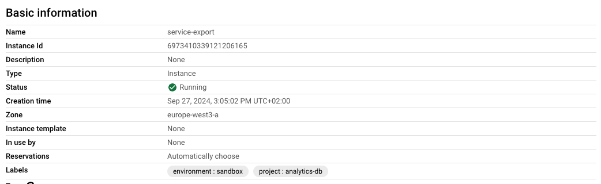
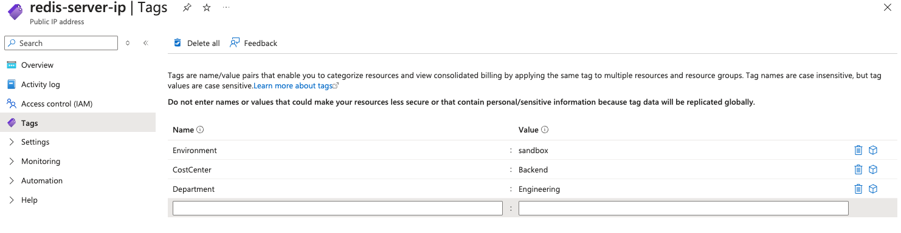
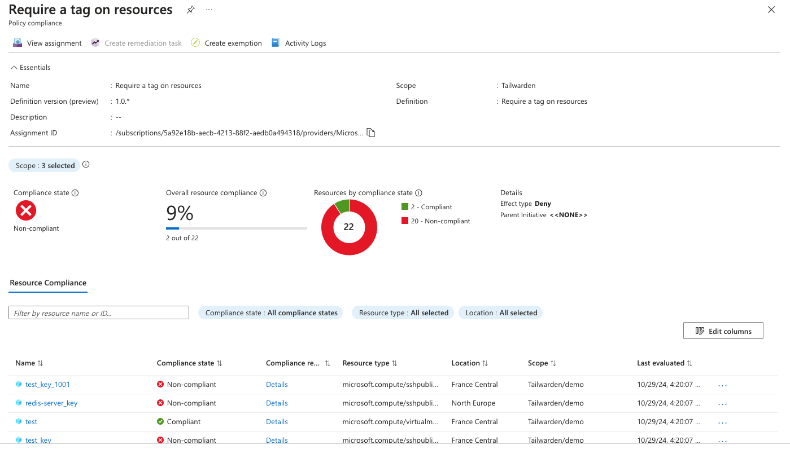
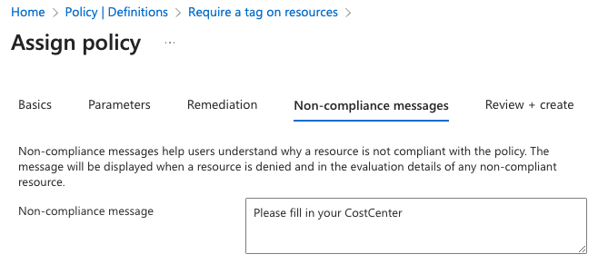
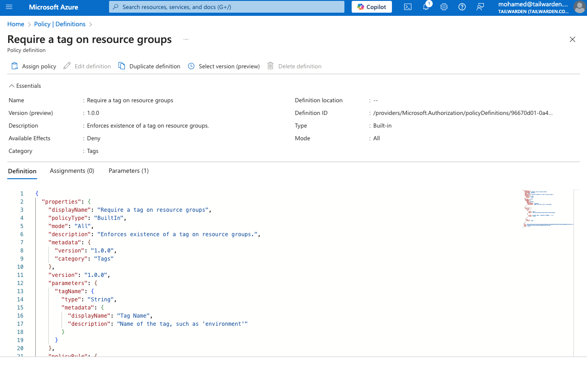
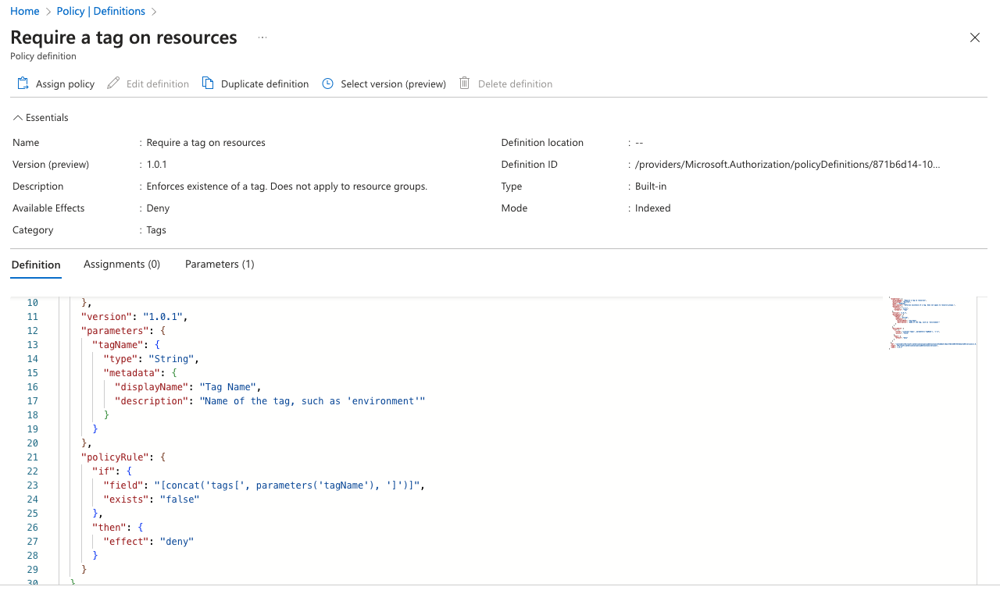
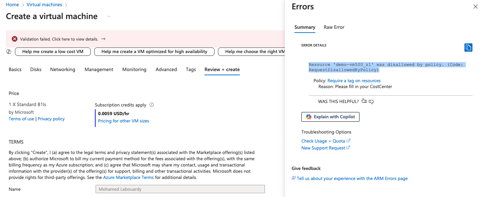
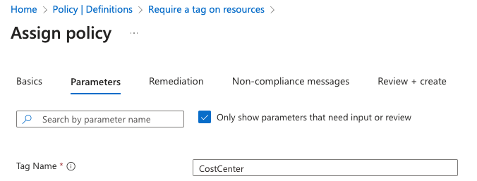
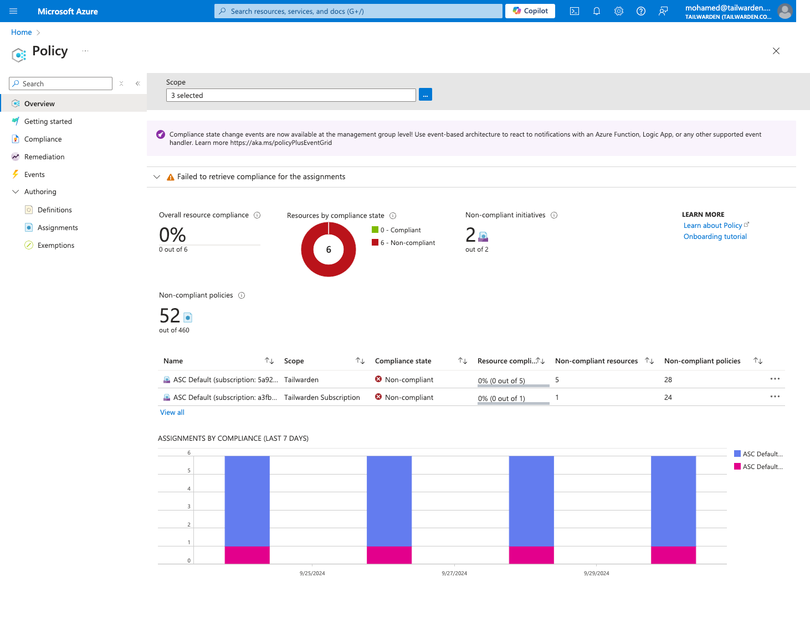

## Cloud Native Tools for Tagging Cloud Resources

Google Cloud Console provides an easy-to-use interface for applying labels to resources such as Compute Engine instances, BigQuery datasets, and Cloud Storage buckets.

To use it, jump to the Google Cloud Console and navigate to the resource you want to label (e.g., Compute Engine instance). Under the “Labels” section, add key-value pairs (e.g., *environment:sandbox*, *project:analytics-db*). Save the labels and verify that they are applied to the resource. The screenshot below confirms those labels were successfully added:





###### Figure 4.6 Virtual machine labels

You can also use the gcloud CLI to automate the application of labels across multiple resources:


#### Listing 4.8 Using gcloud CLI to label resources


```sh
gcloud compute instances add-labels instance-1 \
  --labels=environment=sandbox,project=analytics-db
```


This command adds two labels (*environment=sandbox* and *project=analytics-db*) to the Compute Engine instance instance-1.

You can also bulk tag multiple instances by using the *gcloud* commands to filter and retrieve instance IDs based on labels. Issue the below command to retrieve instances that use f1-micro as a machine type:


#### Listing 4.9 List instances with defined configuration 


```
instance_ids=$(gcloud compute instances list \ --filter="machineType=f1-miro" \ --format="value(id)")
```


This stores the instance IDs with the specified label in the *instance_ids* variable, similar to the AWS example. Next, update the add-labels command to leverage the *instance_ids* variable instead:


####  Listing 4.10  Adding labels to virtual machine


```
gcloud compute instances add-labels $instance_ids \
  --labels=environment=sandbox,project=analytics-db
```


This command tags all instances in *instance_ids* with the specified label.


### Google Cloud Asset Inventory

As shown in the previous chapter, Google Cloud Asset Inventory (GCAI) can also be useful for tracking GCP resources, and by combining labels, you can identify resources missing critical metadata, such as the *CostCenter* label, which is often important for cost-tracking. By identifying unlabeled resources, teams can ensure that all assets are assigned to the appropriate cost center, reducing the likelihood of “orphaned” costs and improving financial accountability.

To list resources without the *CostCenter* label, you can issue the following command:


#### Listing 4.11  Listing resources without CostCenter label


```
gcloud asset search-all-resources --query="NOT labels:CostCenter"
```


This query helps identify all resources that are missing the *CostCenter* label, ensuring proper cost attribution. By regularly checking for unlabeled resources in Asset Inventory, teams can improve their tracking accuracy, ensuring better cost allocation and a clearer picture of cloud spending. This can be automated by combining the initial search command with a loop that applies the *CostCenter* label to each identified resource. Here’s how you can do it:

**Listing 4.12  Searching for virtual machines without a CostCenter**


```
resource_ids=$(gcloud asset search-all-resources \ --scope=organizations/your-organization-id \ --query="NOT labels:CostCenter AND assetType=compute.googleapis.com/Instance" \ --format="value(name)")
```


This command filters for Compute instances missing the *CostCenter* label and outputs the resource names in plain text format, storing them in the *resource_ids* variable. Next, write the following bash script:


```
for resource in $resource_ids; do
   instance_name=$(echo $resource | awk -F/ '{print $NF}')
   instance_zone=$(echo $resource | awk -F/ '{print $(NF-1)}')

   gcloud compute instances add-labels $instance_name \
       --zone=$instance_zone \
       --labels=CostCenter=YourValue
done
```


The for loop iterates over each resource in *resource_ids*, extracting the *instance_name* and *instance_zone* from the full resource name (formatted as *projects/your-project/zones/zone/instances/instance-name*). These extracted values are then used in the gcloud compute instances add-labels command to apply the *CostCenter* label to each instance within its respective zone. By running this script, you ensure that all Compute Engine instances missing the *CostCenter* label are tagged consistently.

After exploring tagging resources in GCP, we’ll now look at how Azure handles tagging and how it supports FinOps principles for effective cloud management.


### Azure Portal and CLI

Similar to AWS and GCP, the Azure Portal is a good starting point for tagging, as it allows you to tag resources individually or in bulk through a simple user interface. To tag a resource, navigate to its service console and select the resource to open its configuration page. From there, click on the “Tags” tab and edit the tags, as shown in the screenshot below, to manage tags on a public IP address resource.





###### Figure 4.7. Tagging an Azure resource

However, this can be tedious that why using the Azure CLI is highly recommended. You can use the following command, for example, to tag an Azure Virtual Machine with the *CostCenter* tag key:


#### Listing 4.12 Command to tag a virtual machine


```
az resource tag --tags CostCenter=Backend --name myVM --resource-group myResourceGroup --resource-type "Microsoft.Compute/virtualMachines"
```


This command tags the virtual machine *myVM* under the resource group *myResourceGroup* with the specified tags.

You can also apply tags across different resource types; for example, you can use tag resources like Storage Accounts, Virtual Machines, and Cloud Functions with the following commands:

First, you’ll need to retrieve the IDs of the resources you want to tag. You can filter by resource type to get Storage Accounts, Virtual Machines, and Functions separately and store the resource IDs for each service in separate variables.


#### Listing 4.13  Get Storage Account IDs


```
storage_account_ids=$(az storage account list --query "[].id" -o tsv) 
```


#### Listing 4.14  Get Virtual Machine IDs


```
vm_ids=$(az vm list --query "[].id" -o tsv)
```


#### Listing 4.15  Get Function App IDs


```
function_app_ids=$(az functionapp list --query "[].id" -o tsv)
```


Then, use a loop to apply the *CostCenter* tag by combining the resource IDs into a single variable and tagging them all at once.


#### Listing 4.16  Get Function App IDs


```
all_ids="$storage_account_ids $vm_ids $function_app_ids"
for id in $all_ids; do
    az resource tag --ids $id --tags CostCenter=Backend
done
```


Next, use a loop to apply the *CostCenter* tag by combining the resource IDs into one variable and tagging them all simultaneously.

### Azure Policy

Similar to AWS, Azure offers a service called [Azure Policy](https://learn.microsoft.com/en-us/azure/governance/policy/overview) that can enforce organizational tagging policies, ensuring all resources follow consistent tagging guidelines. Azure Policy can audit resources to verify proper tagging and can even apply missing tags automatically.

To create a tagging policy, go to the Azure Portal and search for the “Policy” service using the search bar.





###### Figure 4.24. Azure policy service page

Then, go to “Definitions” within the “Authoring” section, where you’ll find a list of predefined policies that you can use. For example, you can leverage the “Require a tag on resources” policy to prevent the launch of Azure resources without a predefined tag key. The policy configuration is shown in the screenshot:



 


###### Figure 4.25. Azure policy example

Click on the “Assign” button and set the subscription you want to target as the scope for this policy, leaving the rest as default. In the “Parameters” section, set *CostCenter* as the required tag key.




###### Figure 4.26. Making CostCenter tag key a requirement

On the next tab, leave the default values for the “Remediation” section and set a non-compliance message that will be displayed to the user when a resource is created without the *CostCenter* tag key.





###### Figure 4.27. Example of non-compliance message

Review and create the policy. On the policy information page, it will evaluate existing Azure resources and mark those missing the *CostCenter* tag key as non-compliant, as shown in the screenshot below.





###### Figure 4.28. List of Azure resources missing the CostCenter tag key

Let’s test it with new resources by attempting to launch an Azure VM without the *CostCenter* tag key. The policy will prevent the VM deployment, and a “Validation failed” error message will appear. Clicking on it will display the tagging policy non-compliance message we configured above, as shown in the screenshot.





###### Figure 4.29. Unable to launch a VM due to missing CostCenter tag

Now, we’ve a policy that ensures that every Azure resource within the specified scope has a *CostCenter* tag, reducing the chances of missing or incorrect tags across resources. As a result, it increases cost transparency and accountability within the organization.

You can take this further and repeat the same steps to create a “Required a tag on a resource group” policy as well as to enforce tagging at the resource group level:





###### Figure 4.30. Enforcing tagging at the resource group

While cloud-native services provide solid options for managing and enforcing tags, third-party open-source tools can offer additional flexibility and features, especially in multi-cloud environments. In the next section, we’ll explore some popular open-source tools that can help teams maintain consistent tagging across different cloud providers.
