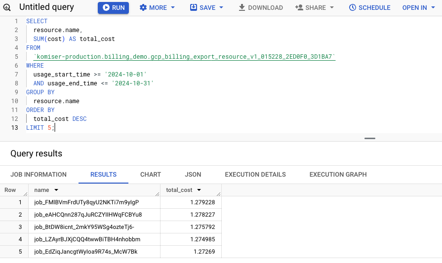

Now that we’ve covered how to build comprehensive cost dashboards for AWS, it's time to expand our focus to other major cloud providers. Understanding cost allocation and tracking across multiple cloud platforms is a must for organizations adopting multi-cloud. In the next part of this chapter, we’ll explore how to track and manage costs on other providers like GCP and Azure, ensuring a holistic view of your cloud expenses.


## 5.4.1 Monitoring and Tracking Costs on GCP

In GCP, you can effectively track and manage cloud costs using tools like [GCP Billing reports](https://cloud.google.com/billing/docs/reports) and exporting data to BigQuery for deeper analysis.

Before you can start monitoring or tracking costs, make sure your project has billing enabled. Begin by navigating to the Billing section in the GCP Console. If you don’t already have a billing account, create one and link it to a payment method. Once set up, ensure that your GCP projects are connected to this billing account to track expenses accurately.

With billing enabled, access the Billing Dashboard in the Google Cloud Console to get a high-level overview of your usage and costs. Below is a screenshot of the main billing page:


###### Figure 5.45. GCP billing page

From the left navigation panel, select “Reports” to view a visual representation of expenses grouped by service or resource. 


###### Figure 5.46. GCP cost reports

Here, you can view cost trends and identify which services are driving the most expenses. You can filter the reports by time range, projects, and services to get deeper insights into where your costs are coming from.


###### Figure 5.47. Apply cost filters

You can also leverage labels covered in previous chapters to categorize resources on GCP, making monitoring costs by different teams, environments, or applications easier. For example, resources can be labeled as "dev" or "prod" or tagged by the department. 

To create and manage labels, go to IAM & Admin, then “Labels” in the Google Cloud Console. Create custom labels based on your organization's needs and apply them when deploying resources such as virtual machines and storage buckets.


###### Figure 5.48. Creating a custom label

After applying labels, you can use the Billing Reports section to filter costs by label, as shown in the screenshot below, giving you granular insights into which teams or applications are consuming the most resources.


###### Figure 5.49. Filtering cost based on environment label key

If you need more advanced analysis, consider exporting your billing data to BigQuery. This enables you to run SQL queries on your billing data and create custom reports for deeper insights. To set this up, go to Billing, select “Billing export”, and choose “BigQuery export in the console. There are two types of data you can enable to export:


* *[Standard usage cost data](https://cloud.google.com/billing/docs/how-to/export-data-bigquery-tables#standard-usage-cost-data-schema)*: Contains standard Cloud Billing account cost usage information, such as account ID, invoice date, services, SKUs, projects, labels, locations, cost, usage, credits, adjustments, and currency.
* *[Detailed usage cost data](https://cloud.google.com/billing/docs/how-to/export-data-bigquery-tables#detailed-usage-cost-data-schema)*: Contains detailed Cloud Billing account cost usage information. Includes everything in the standard usage cost data plus resource-level cost data, like a virtual machine or SSD that generates service usage.

Ensure that both types of data export are enabled by clicking on “Edit Settings” for each and selecting a BigQuery dataset where the cloud billing data will be stored. Below is an example of an enabled cloud billing data export configuration.


###### Figure 5.50. Export billing data to BigQuery

Once the export is enabled, head to the BigQuery console and locate the dataset where your billing data is stored. You should see a table named something like *gcp_billing_export_v1_XXXXXX*. This table contains columns such as:


* *cost*: The cost of the resource used.
* *project.id*: The ID of the project consuming resources.
* *service.description*: The name of the GCP service.
* *usage_start_time* and *usage_end_time*: The timestamps for the usage period.


###### Figure 5.51. List of columns included in BigQuery billing export

With exported billing data, we can now run SQL queries to uncover cost insights. For instance, we can execute the below query to calculate a breakdown of costs by project and service for the specified month, giving you clear visibility into your spending patterns.


#### Listing 5.15  Calculate cost breakdown by project and service


```sql
SELECT
 project.id AS project_id,
 service.description AS service_name,
 SUM(cost) AS total_cost
FROM
 `PROJECT-ID.DATASET.gcp_billing_export_v1_015228_2ED0F0_3D1BA7`
WHERE
 usage_start_time >= '2024-10-01'
 AND usage_end_time <= '2024-10-31'
GROUP BY
 project_id, service_name
ORDER BY
 total_cost DESC;
```


The query output should be similar to something like below:


###### Figure 5.52. Cost breakdown by service and project

Here’s an example query that identifies the top 5 GCP resources, such as specific virtual machines or storage buckets, that are incurring the highest costs within a specified time period:


#### Listing 5.16  Top 5 expensive GCP resources


```sql
SELECT
 resource.name,
 SUM(cost) AS total_cost
FROM
 `PROJECT-ID.DATASET.gcp_billing_export_resource_v1_015228_2ED0F0_3D1BA7`
WHERE
 usage_start_time >= '2024-10-01'
 AND usage_end_time <= '2024-10-31'
GROUP BY
 resource.name
ORDER BY
 total_cost DESC
LIMIT 5;
```


The query output should be similar to something like below:


###### Figure 5.53. Most expensive GCP resources

If you want to track your costs on a daily basis to spot trends or unusual spikes, this query breaks down the total cost by each day within a specified date range:


#### Listing 5.17  Daily cost for September 2024


```sql
SELECT
 DATE(usage_start_time) AS day,
 SUM(cost) AS total_cost
FROM
 `PROJECT-ID.DATASET.gcp_billing_export_v1_015228_2ED0F0_3D1BA7`
WHERE
 usage_start_time >= '2024-10-01'
 AND usage_end_time <= '2024-10-31'
GROUP BY
 day
ORDER BY
 day ASC;
```


The query output should be similar to something like below:


###### Figure 5.54. Output of the previous SQL query

Now that you have billing data in BigQuery, you can visualize it in [Looker](https://cloud.google.com/looker?hl=en) by creating an interactive dashboard for cost analysis.

Start by opening Looker (formerly known as Google Data Studio) and select “Blank Report” option to create a new report. When prompted, add BigQuery as your data source by navigating to the project and dataset where your billing data is stored.

Select the appropriate table, such as *gcp_billing_export_v1_XXXXXX*, to connect your billing data.


###### Figure 5.55. Connecting BigQuery to Looker

With the data source is linked, you can begin building widgets. To create your first chart, add a bar chart to your Looker report and configure *service.description* as the dimension and *SUM(cost)* as the metric. This chart will provide a view of total costs grouped by GCP services, allowing you to see which services contribute the most to your monthly expenses.


###### Figure 5.56. Cost breakdown by GCP service

To track costs over time, add a time series chart. Set *usage_start_time* as the dimension and *SUM(cost) *as the metric. This chart will help you identify trends in your spending, showing how costs fluctuate daily, weekly, or monthly. 


###### Figure 5.57. Cost over time

Improve your Looker report by adding additional charts that provide different perspectives. For example, you could add a geographical map to display costs by region, making it easier to see which GCP location incur the highest expenses. Pie charts or tables can be used to break down costs by resource types, such as Compute Engine or Cloud Storage, giving a better understanding of which resources contribute most to your overall budget.

By following this process, you should now be able to visualize and explore GCP costs effectively using Looker, supported by data exported to BigQuery. 


## 5.4.2 Monitoring and Tracking Costs on Azure

Azure provides [cost management + billing](https://learn.microsoft.com/en-us/azure/cost-management-billing/) as a native service that monitors, manages, and optimizes costs. Before you can start tracking costs, ensure that billing is set up and linked to your Azure subscription.

To access this tool, navigate to the Azure portal and select Cost Management + Billing from the left-hand menu. Here, you will find a high-level overview of your current spending, broken down by subscription, service, or resource group, giving you an initial insight into your cloud expenses.


###### Figure 5.58. Azure cost management dashboard

The Cost Analysis feature within Cost Management + Billing allows for a more detailed exploration of your expenses. By opening Cost Analysis, you can view spending trends over time, grouped by services, resource groups, or regions.


###### Figure 5.58. Grouping cost by different dimensions

This service makes it easier to identify cost drivers and understand which areas of your infrastructure contribute most to your overall expenditure. You can further refine your analysis by grouping costs by specific resources:


###### Figure 5.59. Grouping cost by Azure resource

You can also break down the cost by tag, enabling deeper insight into how different parts of your environment impact your budget. For example, grouping by tags such as *CostCenter* can highlight spending trends related to different business units:




###### Figure 5.60. Grouping cost by CostCenter tag

For teams needing more advanced analysis and reporting capabilities, Azure provides options to export billing data to Azure Storage or directly integrate with Power BI. This is achieved by navigating to Cost Management + Billing and selecting Exports. Here, you can create a new export by choosing a Daily Export to ensure billing data is sent regularly to your designated Azure Storage account. 


###### Figure 5.61. Azure data export

Once the data is stored, tools such as Power BI or Tableau can be used to build custom reports and dashboards, allowing for a more dynamic exploration of your cost data. This approach provides better granularity and a more flexible way to analyze expenses, benefiting FinOps practices by promoting cost transparency and accountability.


###### Figure 5.62. Billing is exported as a CSV file

In this section, we covered how to monitor and manage cloud costs on Azure using built-in tools like Cost Management + Billing and custom solutions involving Power BI and storage exports. You should now be able to leverage these tools for comprehensive cost tracking and reporting, creating dashboards that reflect your organization's financial needs.
