# 6.4 Expanding Forecasting and Budgeting Beyond AWS

Now that we’ve explored cost forecasting, budgeting, and anomaly detection using AWS, it's essential to understand how to apply similar FinOps principles in other major cloud providers, like Google Cloud Platform (GCP) and Microsoft Azure. Each provider offers its own set of tools and best practices for cost management, and this section will guide you through setting up forecasting, budgeting, and anomaly detection in both GCP and Azure.


## Forecasting, Budgeting, and Anomaly Detection in GCP

GCP provides built-in capabilities to forecast your future cloud spending, allowing you to make data-driven decisions. Open the Google Cloud Console and navigate to Billing. Under the Reports section, you’ll find detailed cost reports that provide insights into your past spending and forecasts for future costs.


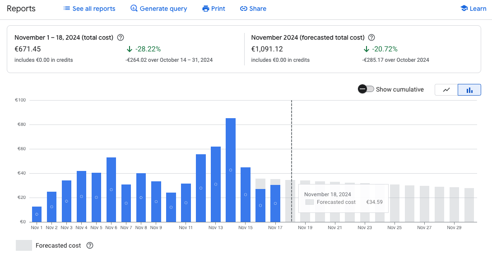


###### Figure 6.44. Forecasting with GCP Billing Report

Use the Cost Table to break down your expenses by *service*, *project*, or *label*. The built-in forecast feature uses historical data to project your future costs. Adjust the filters to refine your forecast, focusing on specific projects or services.

Analyze the forecasted data to plan for upcoming expenses and align your budgets with expected business needs. For more advanced analysis, export the cost data to BigQuery for custom forecasting using machine learning models. For example, you can use the *ARIMA_PLUS* model in BigQuery for forecasting. 


    **Note **ARIMA (AutoRegressive Integrated Moving Average) is a statistical model designed for analyzing and predicting data points over time. The PLUS extension enhances ARIMA by integrating additional features like anomaly detection.

The following SQL query creates a forecasting** **model called *billing_forecast* using the ARIMA_PLUS algorithm. The input data for the model is grouped by day and calculates the total cost of Compute Engine service, providing a structured dataset for training. The second part of the query uses the trained model to forecast costs for the next 30 days. The `ML.FORECAST` function outputs predicted values along with confidence intervals, enabling teams to prepare for expected trends as well as best- and worst-case scenarios. These forecasts can help identify potential spikes in spending, allowing teams to take proactive measures to optimize budgets and resource usage.


#### Listing 6.3 Machine learning forecasting with ARIMA Plus


```
CREATE OR REPLACE MODEL billing_forecast
OPTIONS(model_type='ARIMA_PLUS') AS
SELECT
 TIMESTAMP_TRUNC(usage_start_time, DAY) AS date,
 SUM(cost) AS total_cost
FROM
 `billing_data.gcp_billing_export`
WHERE
 service.description = 'Compute Engine'
GROUP BY
 date
ORDER BY
 date;

SELECT
 *
FROM
 ML.FORECAST(MODEL billing_forecast, STRUCT(30 AS horizon));
```


Similarly to AWS, in GCP you can also set up budgets. This can be done by going to Billing, then Budgets & Alerts. Click “Create Budget” and choose the billing account. Name your budget and specify the scope, such as a specific project or all projects under your account. Then, set a spending limit and define alert thresholds (e.g., 50%, 75%, and 90% of the budget) as shown below:


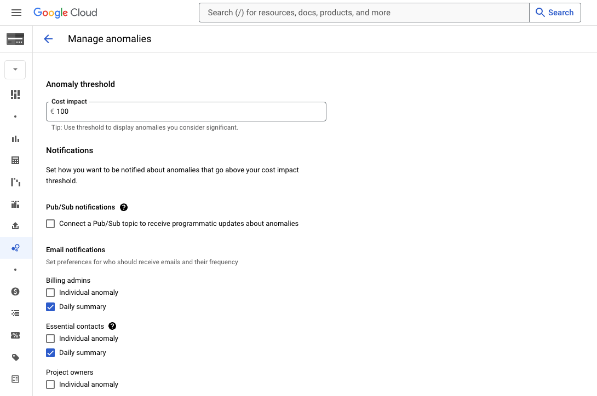


###### Figure 6.45. Setup budget thresholds

Choose how you want to be notified when your spending approaches or exceeds the set budget, such as via email or Pub/Sub notifications for integration with third-party tools. Then, create the budget, below is the created budget:


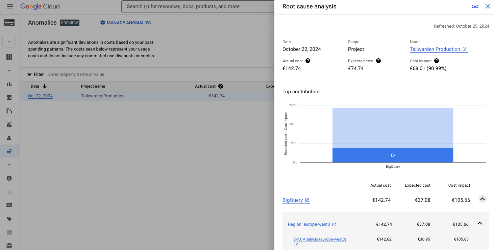


###### Figure 6.46. List of budgets created

Similarly to AWS, GCP provides also a service for anomaly detection to catch unusual spending patterns early. In the Google Cloud Console, go to Billing and select Anomalies. Click on "Manage Anomalies" as shown below:


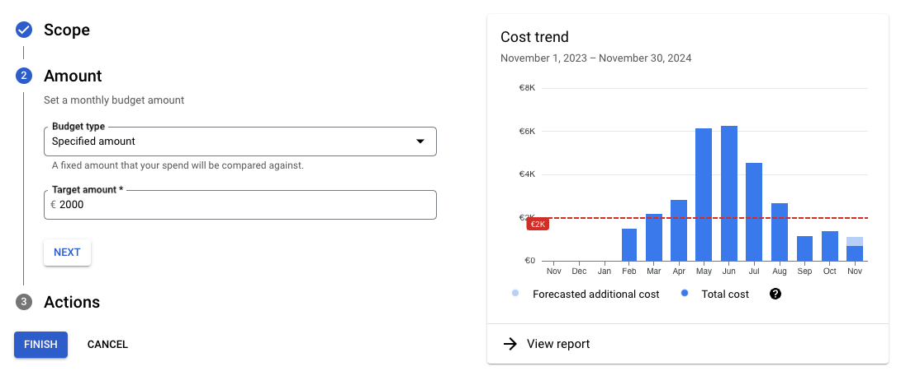


###### Figure 6.47. Manage anomalies in GCP

Set up alerts to detect when spending deviates significantly from the norm. You can customize the sensitivity based on your preferences. Use the Cost Breakdown tool to identify the source of unexpected expenses and make adjustments to prevent further issues.


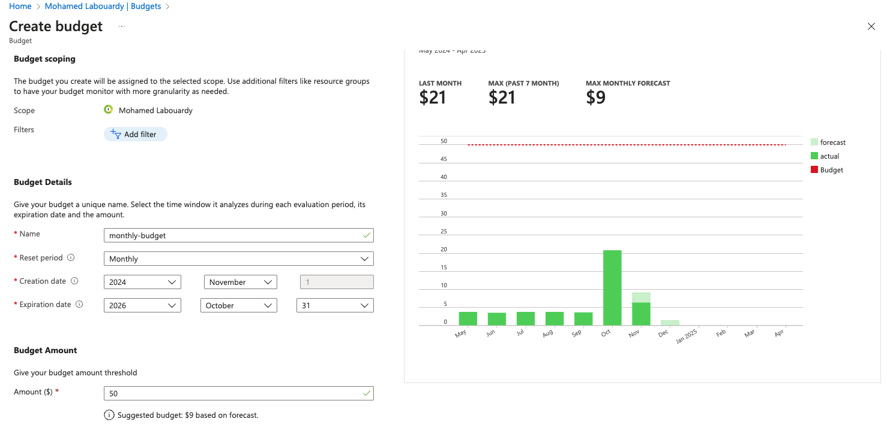


###### Figure 6.48. Root cause analysis for an anomaly

With GCP covered, let’s move on to Microsoft Azure. Azure offers powerful services to forecast costs, set budgets, and manage spending across your resources. In the next section, we’ll explore how to use these features to stay in control of your cloud expenses.


## Forecasting, Budgeting, and Anomaly Detection in Azure

Azure Cost Management provides features to forecast and analyze your spending.

Open the Azure Portal and navigate to Cost Management + Billing section, where the following cost explorer will be displayed:


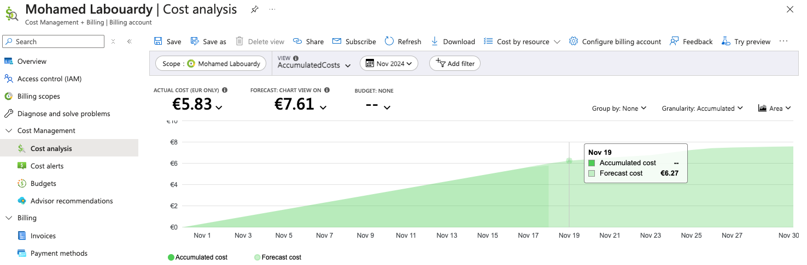


###### Figure 6.49. Azure cost explorer

Azure automatically provides a forecast based on your historical usage data. You can customize the view to focus on specific services or resource groups. You can also do a forecast for a center center by leveraging filters and tags:


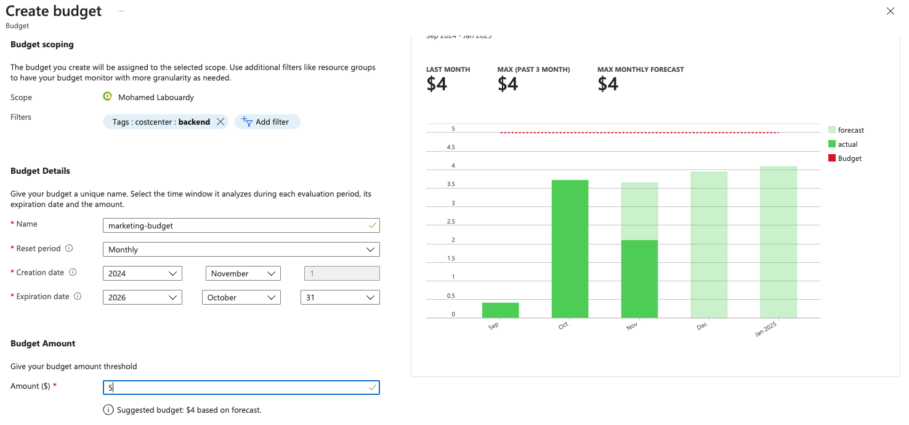


###### Figure 6.50. Forecast of a cost center in Azure

Azure’s budget feature helps you set financial boundaries and receive alerts. In the Azure Portal, go to Cost Management + Billing > Budgets. Click Add to create a new budget and select the scope (e.g., subscription or resource group).

Enter the budget amount and set alert conditions, such as when spending reaches 80%, 90%, or 100% of the budget.


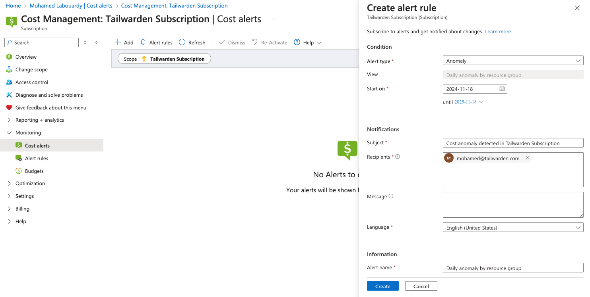


###### Figure 6.51. Create cost budget for the entire Azure infrastructure

You can also leverage filters such as tags to define the budget scope to be at the department, project, app or team level. Below, I used the *costcenter* tag key to create a budget alert for the backend center:

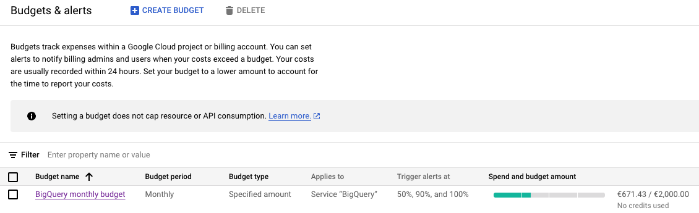


###### Figure 6.52. CostCenter budget on Azure

Define action groups for notifications, which can include emails or integrations with automation workflows such us Slack or Incident Management platforms like PagerDuty.

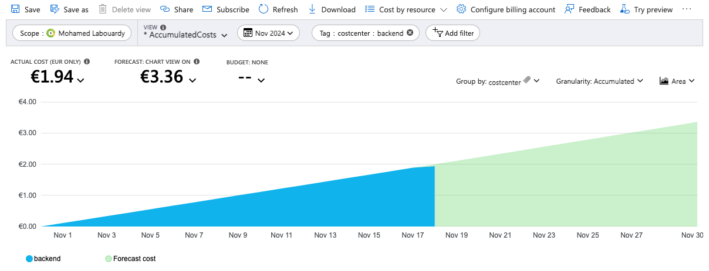


###### Figure 6.53. Trigger email notifications on certain thresholds

Once configured, review your settings and save the budget. Azure will now monitor your spending and alert you as specified.

Azure also offers anomaly detection features to help you keep spending under control. These can be set to monitor specific resources or overall account spending.


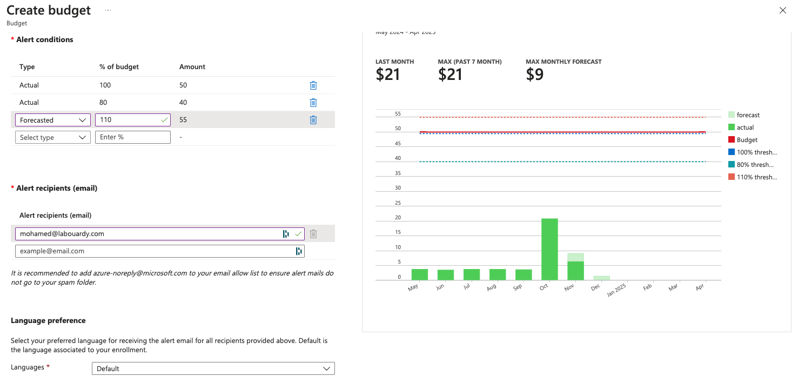


**Figure 6.54. Setup anomaly detection in Azure**

When an anomaly is detected, Azure will notify you. Use Cost Analysis to dig deeper into the source of the anomaly and take corrective actions.

In this section, we've covered how to implement FinOps practices for forecasting, budgeting, and anomaly detection in both GCP and Azure. These services help ensure that cloud spending is optimized and controlled across different cloud platforms. Moving forward, we’ll explore ways to integrate these multi-cloud cost management practices into a unified FinOps strategy.
