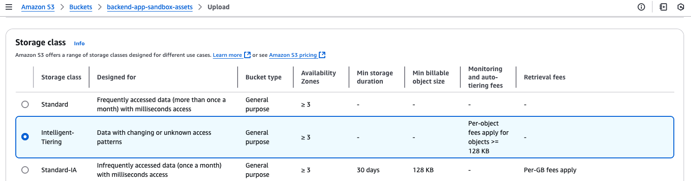
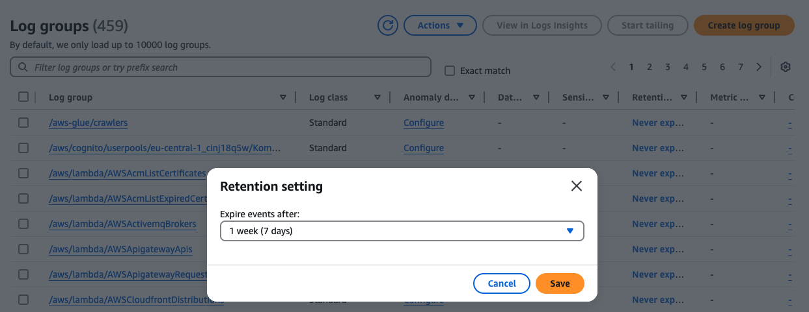
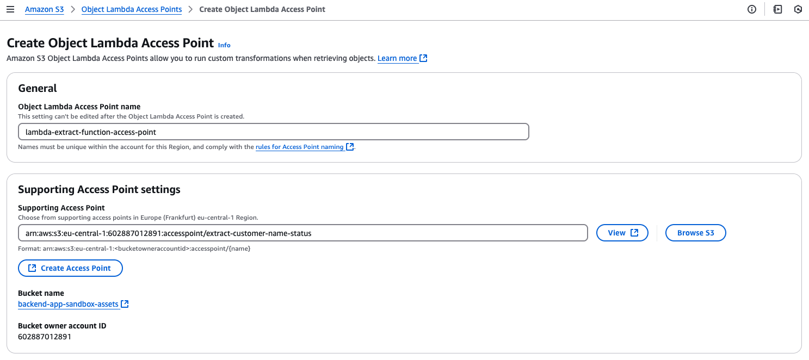

## 8.3.4 Multi-Cloud Storage Optimization

As more organizations adopt a multi-cloud strategy, optimizing storage costs across AWS, GCP, and Azure becomes essential. Each cloud provider offers similar storage tiers, but their pricing, data transfer policies, and tooling differ. Without unified visibility and governance, you risk redundant data, underused volumes, and uncontrolled costs.

After building storage visibility and cost control within AWS, this section walks you through how to extend those practices across cloud providers and build a more unified optimization strategy.


### Unify Visibility with Open-Source Tools

The first challenge in multi-cloud optimization is knowing what exists across platforms. To address this, tools like CloudQuery and Steampipe allow you to collect and query multi-cloud storage metadata in SQL. For example, you can sync all your buckets, blobs, and volumes from AWS, Azure, and GCP into a PostgreSQL or ClickHouse database, and query it like a central asset inventory.

Integrate this into scheduled audits and export results to create interactive dashboards (e.g. Grafana or Looker Studio).


### Reduce Data Egress and Fragmentation

In a multi-cloud setup, data egress fees and cross-region transfers can silently dominate your storage bill. For instance, copying analytics data from AWS to GCP for processing may incur outbound charges in one provider and inbound delays in the other.

To minimize these costs, co-locate storage with compute whenever possible. If you're training machine learning models on GPUs in GCP, store the training data in GCS, not S3. Likewise, use Cloud CDN, Azure CDN, or CloudFront to cache static content close to users and reduce repeated data transfer across regions.

Whenever possible, avoid redundant cross-cloud backups unless required for compliance.


### Use Consistent Tagging and Cost Allocation

Tagging is just as critical in multi-cloud as it is in AWS. Without a consistent tagging schema, it's impossible to track ownership, assign cost, or trigger lifecycle automation across providers.

Define a universal schema (e.g. `project`, `owner`, `environment`, `cost_center`) and apply it to AWS Tags, Azure Resource Tags, and GCP Labels. This allows third party platforms like CloudZero, Apptio, or Finout to map costs by team or business unit and surface actionable insights in one place.


### Leverage Cold Storage Equivalents Strategically

Each cloud provider offers deep archive or infrequent access tiers, with similar pricing structures and tradeoffs. Align your backup, log, and archival policies accordingly:


* AWS: S3 Glacier Deep Archive
* GCP: Archive Storage
* Azure: Archive Blob

These tiers typically cost under $1/TB per month, but retrieval times can take hours. Use them for data that must be retained but is rarely accessed. To automate transitions, configure lifecycle rules using the native services (e.g. S3 Lifecycle, Object Lifecycle Management in GCP, or Blob Lifecycle Management in Azure).


### Intelligent Tiering at Upload Time

While lifecycle policies are useful for transitioning objects to more cost-effective storage classes, a more efficient strategy is to assign the storage class at the time of upload. This avoids the lifecycle transition fee and ensures your data is placed in the right tier immediately, especially useful when access patterns are unknown or sporadic.

Instead of uploading to the default S3 Standard class, you can specify `INTELLIGENT_TIERING` directly in your PUT Object request using the` x-amz-storage-class` header. This can also be done via the AWS CLI:


#### Listing 8.17 Upload a file to S3 with intelligent tiering


```
aws s3 cp file.log s3://my-bucket/logs/ --storage-class INTELLIGENT_TIERING
```


Or while using the S3 upload console:





###### Figure 8.24 Setting storage class during upload


### Deduplication and Compression in Backup Workflows

Uncompressed logs, reports, and backups waste space regardless of provider. Tools like [restic](https://restic.net/) offer built-in compression and deduplication, with support for S3-compatible backends like MinIO.

Here’s an example of how you can back up a local directory to S3 with deduplication and compression using restic:


#### Listing 8.18 Backup and deduplicate using restic


```
export RESTIC_PASSWORD=supersecure
export RESTIC_REPOSITORY="s3:s3.amazonaws.com/my-backup-bucket"

restic init #A
restic backup /var/data --tag prod-backup #B

#A Initialize repo (run once)
#B Backup and deduplicate
```


You can set up a daily cron job or AWS Systems Manager automation to run this on EC2 instances or EFS mounts.

Also, if you're generating large log files, CSV/JSON analytics exports, or archives, compress them before uploading using gzip, zstd, or bzip2:


#### Listing 8.19 Compressing logs before upload to S3


```
tar -czf logs-2025-04-01.tar.gz /var/log/myapp/
aws s3 cp logs-2025-04-01.tar.gz s3://my-archive-bucket/logs/
```


Even reducing 20 GB to 3 GB in Parquet format can cut both storage and Athena query scan costs significantly.


### Use of S3 Object Lambda for Preprocessing

S3 Object Lambda allows you to transform or filter S3 objects on-the-fly during retrieval. This avoids downloading large unnecessary payloads and helps reduce bandwidth and egress costs.

Imagine you store large JSON objects with detailed customer data. Your application only needs a small subset of the data—say, the customer's name and status. Without Object Lambda, you'd have to download the entire file. With it, you can return just what’s needed.

Object Lambda works by attaching a Lambda function to an S3 access point. This function is triggered whenever an object is retrieved, allowing you to filter, transform, redact, or even dynamically compress the content. 




###### Figure 8.25 S3 Object Lambda Access Point setup

Here’s a minimal example Lambda (in Go) that redacts everything except customer name and status from a JSON object:


#### Listing 8.20 Lambda handler for Object Lambda JSON redaction


```
package main

import (
	"context"
	"encoding/json"
	"fmt"
	"log"

	"github.com/aws/aws-lambda-go/lambda"
)

type S3ObjectInput struct {
	Payload []byte `json:"body"`
}

type Customer struct {
	Name   string `json:"name"`
	Status string `json:"status"`
	// other fields omitted
}

func handler(ctx context.Context, input S3ObjectInput) (string, error) {
	var full map[string]interface{}
	if err := json.Unmarshal(input.Payload, &full); err != nil {
		return "", fmt.Errorf("error parsing object: %v", err)
	}

	customer := Customer{
		Name:   fmt.Sprintf("%v", full["name"]),
		Status: fmt.Sprintf("%v", full["status"]),
	}

	result, _ := json.Marshal(customer)
	return string(result), nil
}

func main() {
	lambda.Start(handler)
}
```


Attach this function to an S3 Access Point, and you’ll reduce both bandwidth and downstream processing needs.


    **Note **Beyond simple payload transformations, S3 Object Lambda also supports more advanced use cases such as dynamically modifying images during retrieval. For example, you can use Object Lambda to [add watermarks to images on the fly](https://aws.amazon.com/getting-started/hands-on/amazon-s3-object-lambda-to-dynamically-watermark-images/), based on the request context (e.g watermarking for non-paying users).


### Managing CloudWatch Logs Retention

Amazon CloudWatch Logs is essential for monitoring and troubleshooting, but if left unconfigured, log groups can grow indefinitely—leading to unexpectedly high storage costs. By default, logs are retained forever, unless you explicitly define a retention period.





###### Figure 8.26 CloudWatch Logs retention configuration in the console

You can use a script or Lambda to apply consistent retention policies across all log groups. Here’s a Go snippet using the AWS SDK v2:


#### Listing 8.21 Setting CloudWatch Logs retention period via Golang


```
cfg, _ := config.LoadDefaultConfig(context.TODO())
client := cloudwatchlogs.NewFromConfig(cfg)

_, err := client.PutRetentionPolicy(context.TODO(), &cloudwatchlogs.PutRetentionPolicyInput{
	LogGroupName:    aws.String("/aws/lambda/my-function"),
	RetentionInDays: aws.Int32(14),
})
if err != nil {
	log.Fatalf("failed to set retention: %v", err)
}
```


Its recommended to shorten retention in dev and test environments (e.g. 7–14 days) and keep longer logs (e.g. 90 days) only in production.


### Optimize Query Efficiency with Compression and Partitioning

When working with large datasets stored in Amazon S3—especially those queried with Amazon Athena, Redshift Spectrum, or AWS Glue—your costs depend not just on how much data you store, but how much data your queries actually scan. Poor file formats and unoptimized queries can lead to inflated bills and slower performance, even if your storage volumes are modest.

To reduce both cost and query time, start by using columnar file formats like Parquet or ORC instead of raw CSV or JSON. 

Here’s a quick example of converting logs stored in CSV to Parquet using PySpark library:


#### Listing 8.22 Converting CSV to Parquet with compression


```
df = spark.read.csv("s3://my-bucket/logs/")
df.write.parquet("s3://my-bucket/logs-parquet/", compression="snappy")
```


Once your data is stored in a columnar format, the next step is to partition it by frequently filtered fields, such as date, region, or team. Without partitioning, queries like the one below force Athena or Redshift to scan your entire dataset—even when only a single day’s worth of data is needed:


```
SELECT * FROM logs WHERE event_date = '2025-04-01';
```


If your data is partitioned by `event_date`, that same query becomes far more efficient. Only the relevant partition is scanned.

Finally, be mindful of how you write your SQL. Avoid using` SELECT *`, which forces the engine to retrieve all columns regardless of whether they're needed. Always select only the fields required by your query:


### Set Up Guardrails for Data Retention

Cloud Custodian allows you to define YAML policies that enforce deletion or tagging standards across your storage resources.

Here’s an example policy to delete EBS snapshots older than 30 days:


#### Listing 8.23 Cloud Custodian policy to delete old EBS snapshots


```
policies:
  - name: delete-old-ebs-snapshots
    resource: ebs-snapshot
    filters:
      - type: age
        days: 30
        op: gt
    actions:
      - type: delete
```


You can extend this across GCP and Azure equivalents using multi-cloud support.


### Optimize Storage for Container Workloads

If you're running containers on Amazon EKS, unused PersistentVolumeClaims (PVCs) can persist long after pods are deleted. You can automate cleanup with this script:


#### Listing 8.24 Script to clean up unused Kubernetes PVCs


```
#!/bin/bash
kubectl get pvc --all-namespaces -o json | jq -r '.items[] | select(.status.phase != "Bound") | [.metadata.namespace, .metadata.name] | @tsv' |
while read namespace pvc; do
  echo "Deleting unused PVC $pvc in namespace $namespace"
  kubectl delete pvc "$pvc" -n "$namespace"
done
```


Use this as part of a cleanup job scheduled via Kubernetes CronJobs or CI/CD pipelines.

You should also audit Amazon EFS file systems for inactivity. In the EFS Console, sort by "Storage Used" and "Access Points" to spot unused mounts—often leftovers from testing or short-lived deployments.

Multi-cloud brings flexibility—but also complexity. By extending tagging, rightsizing, lifecycle automation, and visibility practices across providers, you gain the same cost control you’ve built in AWS, but at global scale.
